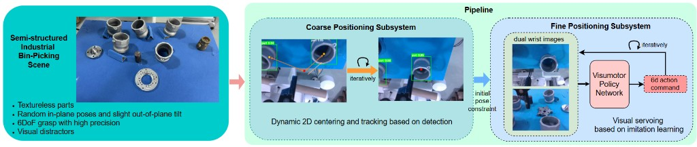

# TexurelessServo

Official implementation for:

**[CASE 2026] A Calibration-Free Two-Stage Visual Servoing Framework for Industrial Bin-Picking via Online Imitation Learning**

**Authors:** Zixi Ying, Shuhang Kong, Xiaowu Kong, Xuanyang Liu

This repository implements a two-stage RGB-only visual servoing framework for semi-structured industrial bin-picking. The pipeline first performs YOLO-based coarse 2D centering, then uses an online imitation learning policy to servo the robot to a precise 6-DoF grasp pose from dual wrist camera images.



## Method Overview

- **Coarse positioning:** detect the target part with YOLO and iteratively center it in the eye-in-hand camera view.
- **Fine positioning:** use a visuomotor policy with dual wrist RGB images to predict 6-DoF end-effector actions.
- **Online training:** train the fine-positioning policy with an improved Greedy-DAgger procedure and automatic expert trajectory generation.
- **Deployment:** run the complete coarse-to-fine pipeline in simulation or on the real robot.

## Setup

Set the repository root as `PYTHONPATH` before running scripts:

```bash
export PYTHONPATH="/path/to/TexurelessServo:$PYTHONPATH"
```

On Windows PowerShell:

```powershell
$env:PYTHONPATH="F:\TexurelessServo;$env:PYTHONPATH"
```

## Offline Training

Train the behavior cloning policy from an HDF5 dataset:

```bash
python experiments/experiment.py
```

The default training configuration is in `configs/train_mlp.json`. Transformer-based configurations are kept for reference, but they performed worse in our experiments and are not recommended as the default choice.

## Online Training

The online imitation learning code is provided for both simulation and real-world settings.

### Simulation

- Script: `data/collect_demo_greedy_dagger.py`
- Config: `configs/demo_collection_greedy_dagger.json`

```bash
cd data
python collect_demo_greedy_dagger.py
```

### Real Robot

- Script: `data/collect_demo_real_async_mp_new_greedy_dagger.py`
- Config: `configs/demo_collection_real_greedy_dagger.json`

```bash
cd data
python collect_demo_real_async_mp_new_greedy_dagger.py
```

Before running online training, update dataset paths, model checkpoint paths, camera IDs, and robot IP settings in the corresponding config file.

## Rollout

### Simulation Environment

```bash
python experiments/rollout.py
```

### Real-World Environment

```bash
python experiments/rollout_real.py
```

### Coarse-to-Fine Pipeline

```bash
python real/coarse-to-fine_positioning.py
```

## Data Collection

Collect expert demonstrations in simulation:

```bash
cd data
python collect_demo.py
```

## Real-World Data Augmentation

### 1. Prepare YOLO Training Data

```bash
python data/make_yolo_raw_dataset.py
```

### 2. Data Annotation with RoboFlow

1. Upload the generated YOLO-format data to RoboFlow.
2. Annotate and augment the data.
3. Export the annotated dataset.

### 3. Train YOLO Model

```bash
python data/train_yolo.py
```

### 4. Create Augmented HDF5 Dataset

```bash
python data/make_augmented_hdf5.py
```

## Collision Detection Module Installation

The real-world online training pipeline uses a C++ collision detection module with Python bindings via pybind11.

### Prerequisites

- CMake >= 3.10
- Make
- Python development headers, such as `python3-dev`
- pybind11

### Installation Steps

1. Install Python dependencies:

   ```bash
   pip install numpy trimesh pybind11
   ```

2. Compile the C++ module:

   ```bash
   cd real/collision_detection
   mkdir build
   cd build
   cmake ..
   make
   ```

3. Verify installation:

   ```bash
   cd ..
   python -c "import sdf_module; print(sdf_module.__doc__)"
   ```

### Notes

- Compile the module inside `real/collision_detection`.
- If pybind11 is not found, check its installation path with `pip show pybind11` and make sure CMake can locate it.
- When using the module, add `real/collision_detection` to `PYTHONPATH`.
